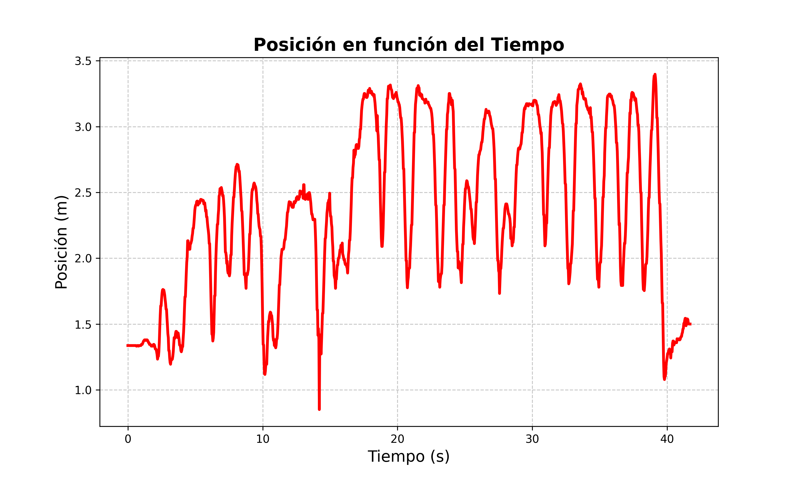

# 📌 Análisis y Seguimiento en Barras Asimétricas

Este proyecto realiza el análisis y seguimiento de movimientos en barras asimétricas mediante procesamiento de video, generando métricas deportivas y visualizaciones de trayectoria.

## 📂 Estructura del Repositorio

```
/
├── HSV_Scale/                              # Imagen de prueba para calibración
├── input/                                  # Vídeo de entrada
├── output/                                 # Salidas obtenidas
|   ├─ gaph_mov.png                         
|   ├─ video_out.mp4
├── detector_main.py                        # Script principal de procesamiento de video
├── interfaz_hsv.py                         # Interfaz para ajustar parámetros HSV
├── interfaz_scale_px.py                    # Interfaz para calcular escala píxeles/metros
├── requirements.txt                        # Dependencias del proyecto
├── Memoria_DiegoGonzalez_PaulaPena.pdf     # Documentación del proyecto
└── README.md                               # Presentación del repositorio.            

```

## 🚀 Funcionalidades
Dado un vídeo de entrada (ubicado en la carpeta `input/`), el sistema permite:
- Calibración HSV (interfaz_hsv.py): Interfaz interactiva para ajustar parámetros de color.
- Calculadora de escala (interfaz_scale_px.py): Conversión precisa píxeles/metros.
- Procesamiento de video (detector_main.py): Seguimiento de deportistas y cálculo de métricas.

## 📊 Resultados  

A continuación se presentan las principales salidas obtenidas del proyecto:  

- 🎥 **Vídeo**: seguimiento del centro de masa en la trayectoria de la deportista junto con métricas deportivas analizando cuantitativamente el movimiento.  
- 📈 **Gráfico**: evolución de la posición en función del tiempo. 
  
https://github.com/user-attachments/assets/b4ad2c26-1f92-44d4-9101-30d136a9bdce



## 👥 Autores
- Diego González Oviño
- Paula Pena González

## 📄 Licencia
Proyecto académico de la Universidad Rey Juan Carlos.

